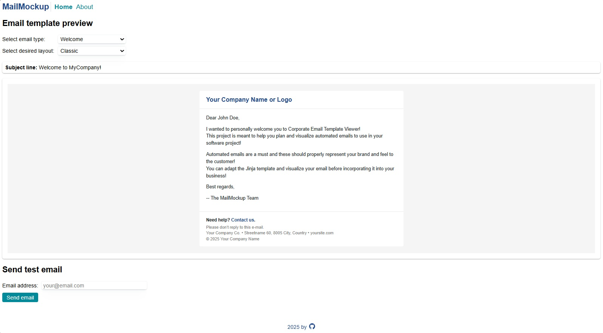

# MailMockup

A simple Flask app to visualize and test corporate email template layouts.

Developers can define multiple layout options for automated emails such as newsletters, onboarding emails, account creation emails, and more.  
Users can preview each email type in different layout formats and optionally send a test email to themselves.


## Table of contents
- [Installation](#installation)
- [Project layout](#project-layout)
- [Usage](#usage)
- [About and license](#about-and-license)

## Installation

### create virtual env
```powershell
python -m venv env
.\env\Scripts\activate
```

### install dependencies
```powershell
pip install -r requirements.txt
```
to update dependencies:
```powershell
pip freeze > requirements.txt
```

### configure environment
Copy the example env and edit:
```bash
cp .env.example .env   # (Windows PowerShell: copy .env.example .env)
```
Add your email credentials if you want to use the email-sending feature
(this is optional — the app still works without sending emails).

### run the project
```powershell
python run.py
```

<div align="right">[ <a href="#table-of-contents">↑ to top ↑</a> ]</div>

## Project layout
```
mailMockup/
├── app/
│   ├── __init__.py               # Create-app factory
│   ├── routes.py                 # Routes for pages and email previews
│   ├── email/                    # Email template catalogue + email-sending logic
│   ├── templates/
│   │   ├── emails/               # Email templates in multiple layouts
│   │   ├── layout.html           # Base layout for website pages
│   │   ├── home.html             # Homepage
│   │   └── about.html            # About page
│   └── static/
├── run.py                        # Entry point
├── config.py                     # App configuration
├── utils/                        # General helper functions and scripts
├── requirements.txt
├── .env.example
├── .gitignore
└── README.md
```

### config, utils, run.py

run.py loads configuration from config.py and initializes the app using create_app() from app/__init__.py.

The utils folder contains small utility helpers, such as a terminal logging function and a script that generates a directory tree.

### routes.py

Contains all routes:

- Routes to render HTML pages
- API routes that fetch email templates or send emails

### email template organization

The CSS file in the static folder is used only for the website pages — not for the email templates.
Email templates use inline CSS to ensure that email clients do not strip important styling.

Website pages (layout.html, home.html, about.html) live inside templates/.

Email templates live inside templates/emails/, organized by layout:

```
├── app
│   ├── # ...
│   └── templates
│       ├── emails
│       │   ├── layout_1
│       │   │   ├── base
│       │   │   │   ├── footer.html
│       │   │   │   └── header.html
│       │   │   ├── welcome.html
│       │   │   ├── newsletter.html
│       │   │   ├── verify_email.html
│       │   │   └── # ...
│       │   ├── layout_2
│       │   │   ├── base
│       │   │   │   ├── footer.html
│       │   │   │   └── header.html
│       │   │   ├── welcome.html
│       │   │   ├── newsletter.html
│       │   │   ├── verify_email.html
│       │   │   └── # ...
│       │   └── ...
```

Each layout folder contains the same email template names, but styled differently.
The header and footer for each layout are stored in a base/ subfolder.

The paths to these layouts are defined in app/email/catalogue_layout.py, where each layout folder gets a user-friendly name (e.g. "Classic", "Modern", etc.).

Likewise, each email template (e.g. newsletter.html, verify_email.html) — along with its subject line — is defined in app/email/catalogue_email.py.

```
├── app
│   ├── __init__.py
│   ├── email
│   │   ├── __init__.py
│   │   ├── catalogue_email.py
│   │   ├── catalogue_layout.py
│   │   └── #...
```
These catalogues are used by the route functions to let the user preview each template in each layout.

<div align="right">[ <a href="#table-of-contents">↑ to top ↑</a> ]</div>

## Usage

### Adding new email templates or layouts to the project

To add a new email template:

- Create the Jinja template under each templates/emails/layout_x/ folder
- Add an entry for it in catalogue_email.py

To add a new layout:

- Create a new folder under templates/emails/
- Add the new layout entry in catalogue_layout.py

That's it!

⚠️ Note: HTML/CSS support varies widely across email clients.

This project includes a guide that may help: <a href="app/templates/ABOUT_HTML_IN_EMAILS.md">app/templates/ABOUT_HTML_IN_EMAILS.md</a>

### Interface

The client interface is straightforward:
- On the homepage, users select an email type and a layout to preview it
- Optionally, they can enter their email address and click Send email to receive the rendered version in their inbox

The About page contains a simple explanation of the project.



<div align="right">[ <a href="#table-of-contents">↑ to top ↑</a> ]</div>

## About and license

This is a personal project created by the author, and you are welcome to use and modify it.
The author and maintainers are not liable for any damages or losses caused by the use of this project.
Use this project at your own risk.
No warranty or guarantee is provided regarding reliability, accuracy, or completeness.
By using this project, you agree to hold harmless the owners and maintainers from any liability or damages arising from its use.

<div align="right">[ <a href="#table-of-contents">↑ to top ↑</a> ]</div>


## Obs
- Environment variables are loaded via `python-dotenv` if a `.env` file is present.
- Adjust `SESSION_COOKIE_SECURE`, `REMEMBER_COOKIE_SECURE`, and `PREFERRED_URL_SCHEME` when using HTTPS.
